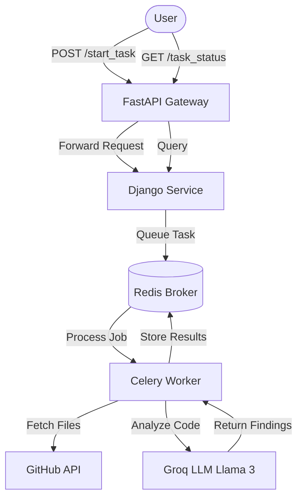

# AI-Powered Microservices Code Reviewer

An automated, microservices-based code review tool that leverages LLMs (Llama 3 via Groq) to analyze GitHub Pull Requests for code style, potential bugs, performance improvements, and best practices.

## 🚀 Architecture Overview

This project is built using a decoupled microservices architecture to ensure scalability and separation of concerns.



## 🛠️ Tech Stack

- **FastAPI**: Lightweight API gateway for entry points and status checks.
- **Django & DRF**: Core business logic and task orchestration.
- **Celery**: Distributed task queue for long-running analysis jobs.
- **Redis**: Message broker and result backend.
- **Groq AI**: High-performance LLM inference engine.
- **GitHub API**: Source for pull request metadata and file contents.

## 📦 Service Breakdown

### 1. FastAPI Gateway (`/fastapi_app`)
- **Port**: 8001 (default)
- **Role**: Provides a clean interface for external users. It validates input and forwards requests to the Django backend.
- **Endpoints**:
    - `POST /start_task`: Accepts repository details and initiates analysis.
    - `GET /task_status/{task_id}`: Polls for the current status and results of a task.

### 2. Django Service (`/django_app`)
- **Port**: 8000 (default)
- **Role**: Handles persistence, task management, and communication with the Celery worker.
- **Endpoints**:
    - `POST /start_task/`: Internal endpoint to trigger Celery tasks.
    - `GET /task_status_view/{task_id}/`: Internal endpoint to query Celery result backend.

### 3. AI Agent & GitHub Utils
- **GitHub Utility**: Parses repository URLs, fetches file lists from PRs, and decodes file content.
- **AI Agent**: Constructs prompts for the LLM and parses the structured JSON output containing code improvements.

## ⚙️ Setup & Installation

### Prerequisites
- Python 3.10+
- Redis Server (Running on `localhost:6379`)
- GitHub Personal Access Token (for private repos or higher rate limits)
- Groq API Key

### Environment Variables
Create a root `.env` file with the following:
```env
GROQ_API_KEY=your_groq_api_key
GITHUB_TOKEN=your_github_token
```

### Installation Steps
1. **Clone the repository**:
   ```bash
   git clone <repository-url>
   cd Microservices-main
   ```
2. **Install dependencies**:
   ```bash
   pip install -r requirements.txt
   ```
3. **Start the Django Server**:
   ```bash
   cd django_app
   python manage.py runserver 8000
   ```
4. **Start the Celery Worker**:
   ```bash
   # In a new terminal
   cd django_app
   celery -A django_app worker --loglevel=info
   ```
5. **Start the FastAPI Gateway**:
   ```bash
   # In a new terminal
   cd fastapi_app
   uvicorn main:app --port 8001 --reload
   ```

## 📝 Usage Example

### Start a Task
```bash
curl -X POST http://127.0.0.1:8001/start_task \
     -H "Content-Type: application/json" \
     -d '{
           "repo_url": "https://github.com/owner/repo",
           "pr_number": 1
         }'
```

### Check Status
```bash
curl http://127.0.0.1:8001/task_status/<task_id>
```
